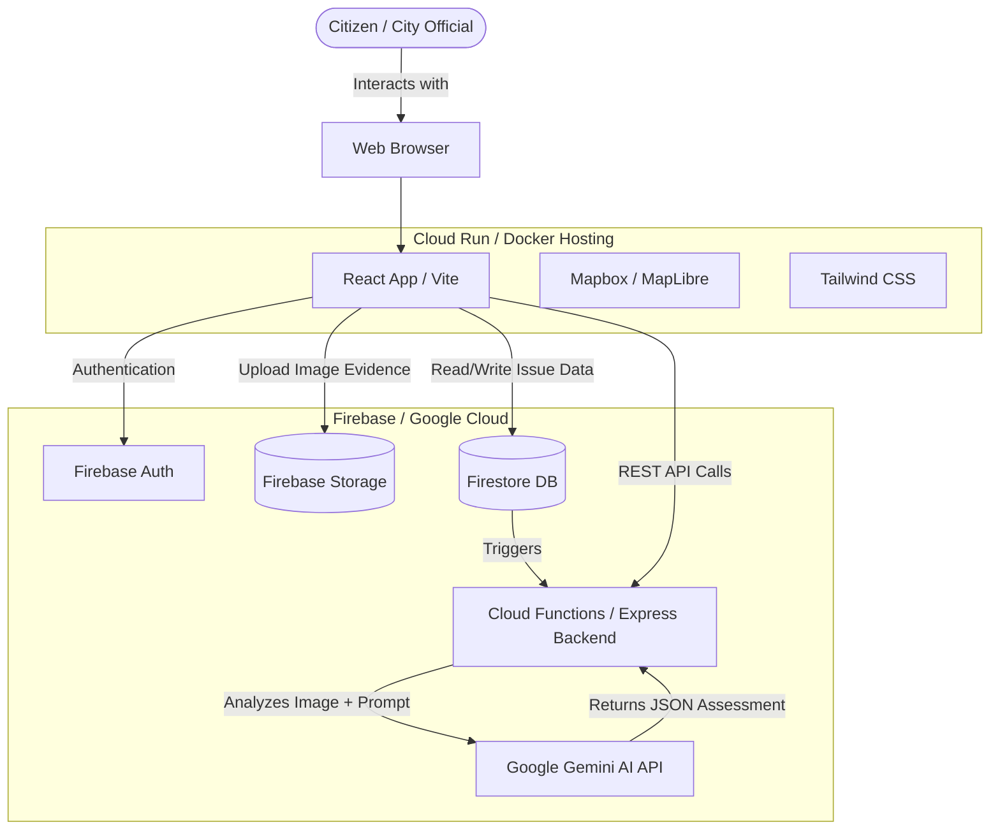

<h1 align="center">CivicGuard</h1>

  <strong>Empowering Citizens to Build Better Cities, Together</strong>

  

 

  

---

## Problem Statement

Communities frequently face issues such as potholes, water leakages, damaged streetlights, waste management concerns, and public infrastructure challenges. Reporting these issues is often fragmented, difficult to track, and lacks transparency.

## Solution Overview

CivicGuard is a modern, crowdsourced civic infrastructure assessment platform. It bridges the gap between citizens and city departments by allowing users to instantly report, verify, and track public issues like potholes, broken streetlights, or waste dumps. 

Using **Google Gemini AI**, the platform automatically assesses uploaded images to filter out spam, categorize the problem, and estimate severity. Validated issues are mapped in real-time, and a community-driven verification system ensures only legitimate, high-priority issues are escalated to city officials. A built-in gamification system rewards users with points and badges, encouraging continuous civic engagement.

---

## Key Features

*   **AI-Powered Issue Reporting:** Upload a photo of an infrastructure issue, and our Gemini AI integration automatically analyzes the image, extracts the category (e.g., "pothole", "streetlight"), and assigns a severity score while filtering out spam.
*   **Interactive Live Map:** A real-time, responsive map interface (powered by Mapbox/MapLibre) displaying all reported issues in the community with color-coded severity markers.
*   **Community Feed & Verification:** A social feed where citizens can view, upvote, and verify issues reported by others. Issues that receive enough community verifications are automatically promoted to "verified" status.
*   **City Department Dashboard:** A dedicated view for city officials to track metrics, prioritize high-severity infrastructure problems, and manage repair workflows efficiently.
*   **Analytics Dashboard:** Visualized data insights using Recharts to track the most common types of issues, resolution rates, and geographical hotspots.
*   **Gamification & Leaderboards:** Citizens earn civic points for reporting and verifying real issues, unlocking badges and climbing the community leaderboard (e.g., "Civic Hero").
*   **Secure Authentication & Profiles:** Passwordless or email-based login secured by Firebase Auth, with personalized user profiles to track past reports and total impact.

---

## Architecture Flow

The application is built using a modern decoupled architecture, combining a React/Vite frontend hosted on Google Cloud Run with Firebase backend services and Gemini AI for intelligent processing.

---

## Tech Stack

| Technology | Purpose |
| :--- | :--- |
|  | Frontend UI Library |
|  | Fast Frontend Build Tool |
|  | Utility-first CSS Styling |
|  | Auth, Firestore Database, and Storage |
|  | Containerized Frontend & Express Backend Hosting |
|  | Containerization for consistent environments |
|  | Express API & Cloud Functions Environment |
|  | AI Image Analysis & Spam Filtering |
|  | Interactive Map Components (via MapLibre) |

---

## License

This project is licensed under the MIT License - see the LICENSE file for details.

---

  Made with love ❤️ for VIbe2Ship hackathon by Tushar

